# R&R Full Case Graph v0.1

Status: Draft visual projection  
Depends on: `transition-matrix-v0.1.md`

## Purpose

This artifact is the human-readable visual projection of the R&R case transition matrix.

The transition matrix remains authoritative for guards, actors, and exact transition semantics. This graph exists to make the complete case lifecycle easy to reason about at a glance.

## Graph grammar

Each node is a workflow state.

Each arrow represents a legal transition:

```
CURRENT_STATE -- EVENT [optional guard] --> NEXT_STATE
```

The visual is intentionally "mind-map-esque": the happy path runs left-to-right, while exception, review, retry, re-source, re-quote, and cancellation paths branch away and reconnect where appropriate.

## Full lifecycle graph

```mermaid
flowchart LR

  %% -------------------------
  %% INTAKE
  %% -------------------------
  subgraph INTAKE["1. Intake"]
    A[REQUEST_RECEIVED]
    B[REQUEST_VALIDATION_IN_PROGRESS]
    C[REQUEST_VALIDATION_REQUIRED]
    D[READY_FOR_YMM_SEARCH]

    A -->|VALIDATE_REQUEST| B
    B -->|VALIDATION_FAILED| C
    C -->|REQUEST_DATA_UPDATED| B
    B -->|VALIDATION_PASSED| D
  end

  %% -------------------------
  %% GLASS IDENTIFICATION
  %% -------------------------
  subgraph MATCH["2. Glass Identification"]
    E[YMM_SEARCH_IN_PROGRESS]
    F[YMM_RESULTS_FOUND]
    G[GLASS_MATCH_EVALUATION]
    H[VIN_LOOKUP_REQUIRED]
    I[VIN_LOOKUP_IN_PROGRESS]
    J[HUMAN_GLASS_REVIEW_REQUIRED]
    K[GLASS_IDENTIFIED]
    L[GLASS_NOT_IDENTIFIED]

    D -->|START_YMM_SEARCH| E
    E -->|YMM_RESULTS_RETURNED| F
    F -->|EVALUATE_GLASS_MATCHES| G

    G -->|GLASS_RESOLVED| K
    G -->|VIN_NEEDED: windshield/back only| H
    G -->|HUMAN_REVIEW_NEEDED| J
    G -->|NO_VALID_GLASS| L

    H -->|START_VIN_LOOKUP| I
    H -->|USE_SAVED_VIN_RESULT| G
    I -->|VIN_RESULT_RETURNED| G

    J -->|HUMAN_GLASS_SELECTED| K
    J -->|HUMAN_CANNOT_IDENTIFY| L

    L -->|RETRY_IDENTIFICATION| B
  end

  %% -------------------------
  %% SOURCING
  %% -------------------------
  subgraph SOURCE["3. Sourcing"]
    M[SOURCING_IN_PROGRESS]
    N[OFFERS_FOUND]
    O[OFFER_EVALUATION]
    P[GLASS_SELECTED]
    Q[NO_ELIGIBLE_INVENTORY]

    K -->|START_SOURCING| M
    M -->|SUPPLIER_OFFERS_RETURNED| N
    N -->|EVALUATE_OFFERS| O
    O -->|ELIGIBLE_OFFER_SELECTED| P
    O -->|NO_ELIGIBLE_OFFERS| Q
    Q -->|RETRY_SOURCING| M
  end

  %% -------------------------
  %% PRICING
  %% -------------------------
  subgraph PRICE["4. Pricing"]
    R[PRICING_IN_PROGRESS]
    S[PROFIT_REVIEW_REQUIRED]
    T[PRICE_APPROVED]

    P -->|START_PRICING| R
    R -->|STANDARD_PRICE_CALCULATED| T
    R -->|PRICING_EXCEPTION_DETECTED| S
    S -->|PRICE_APPROVED_BY_RNR| T
  end

  %% -------------------------
  %% QUOTE + APPROVAL
  %% -------------------------
  subgraph QUOTE["5. Quote & Approval"]
    U[QUOTE_GENERATING]
    V[QUOTE_READY]
    W[QUOTE_DELIVERY_FAILED]
    X[AWAITING_APPROVAL]
    Y[QUOTE_APPROVED]
    Z[QUOTE_DECLINED]
    AA[QUOTE_EXPIRED]
    AB[REQUOTE_REQUIRED]

    T -->|GENERATE_QUOTE| U
    U -->|QUOTE_CREATED| V

    V -->|DELIVER_QUOTE| X
    V -->|QUOTE_DELIVERY_FAILED| W
    W -->|RETRY_QUOTE_DELIVERY| V

    X -->|QUOTE_APPROVED| Y
    X -->|QUOTE_DECLINED| Z
    X -->|QUOTE_EXPIRED| AA
    X -->|COMMERCIAL_INPUT_CHANGED| AB

    Z -->|REVISE_AND_REQUOTE| AB
    AA -->|REQUOTE| AB

    AB -->|RESOURCE_FOR_REQUOTE| M
    AB -->|REPRICE_WITH_CURRENT_SELECTION| R
  end

  %% -------------------------
  %% PROCUREMENT
  %% -------------------------
  subgraph ORDER["6. Procurement"]
    AC[INVENTORY_RECHECK_IN_PROGRESS]
    AD[RESOURCING_REQUIRED]
    AE[READY_TO_ORDER]
    AF[PURCHASE_CONFIRMATION_REQUIRED]
    AG[ORDER_IN_PROGRESS]
    AH[ORDER_FAILED]
    AI[GLASS_ORDERED]

    Y -->|START_INVENTORY_RECHECK| AC
    AC -->|SELECTED_OFFER_STILL_AVAILABLE| AE
    AC -->|SELECTED_OFFER_UNAVAILABLE| AD

    AD -->|START_RESOURCING| M

    AE -->|REQUEST_PURCHASE_CONFIRMATION| AF
    AF -->|PURCHASE_CONFIRMED| AG
    AG -->|ORDER_SUCCEEDED| AI
    AG -->|ORDER_FAILED| AH

    AH -->|RETRY_ORDER| AF
    AH -->|RESOURCE_AFTER_ORDER_FAILURE| AD
  end

  %% -------------------------
  %% INSTALLATION
  %% -------------------------
  subgraph INSTALL["7. Installation"]
    AJ[SCHEDULING_REQUIRED]
    AK[INSTALLATION_SCHEDULED]
    AL[INSTALLATION_RESCHEDULE_REQUIRED]
    AM[INSTALLATION_IN_PROGRESS]
    AN[INSTALLATION_EXCEPTION]
    AO[INSTALLATION_COMPLETED]

    AI -->|REQUEST_SCHEDULING| AJ
    AJ -->|INSTALLATION_BOOKED| AK

    AK -->|RESCHEDULE_NEEDED| AL
    AL -->|INSTALLATION_REBOOKED| AK

    AK -->|START_INSTALLATION| AM
    AM -->|INSTALLATION_SUCCEEDED| AO
    AM -->|INSTALLATION_PROBLEM| AN

    AN -->|RESCHEDULE_AFTER_EXCEPTION| AL
    AN -->|REPLACEMENT_GLASS_REQUIRED| AD
  end

  %% -------------------------
  %% CLOSEOUT
  %% -------------------------
  subgraph CLOSE["8. Closeout"]
    AP[FINAL_INVOICE_GENERATING]
    AQ[FINAL_INVOICE_READY]
    AR[JOB_PROFIT_RECORDED]
    AS([COMPLETED])

    AO -->|GENERATE_FINAL_INVOICE| AP
    AP -->|FINAL_INVOICE_CREATED| AQ
    AQ -->|RECORD_JOB_ECONOMICS| AR
    AR -->|CLOSE_COMPLETED_JOB| AS
  end

  %% -------------------------
  %% CANCELLATION
  %% -------------------------
  subgraph CANCEL["Global Cancellation"]
    AT[CANCELLATION_REQUESTED]
    AU([CANCELLED])

    AT -->|CANCELLATION_CONFIRMED| AU
  end

  S -->|PRICE_REJECTED_BY_RNR| AT
  Z -->|CLOSE_DECLINED_CASE| AT
  AA -->|CLOSE_EXPIRED_CASE| AT
  AF -->|PURCHASE_NOT_CONFIRMED| AT
  AN -->|CANNOT_COMPLETE_JOB| AT

  %% Representative global cancellation entry.
  A -. REQUEST_CANCELLATION .-> AT
  K -. REQUEST_CANCELLATION .-> AT
  P -. REQUEST_CANCELLATION .-> AT
  X -. REQUEST_CANCELLATION .-> AT
  AK -. REQUEST_CANCELLATION .-> AT

  %% -------------------------
  %% SYSTEM ATTENTION
  %% -------------------------
  subgraph SYSTEM["Global System Attention"]
    AV[SYSTEM_ATTENTION_REQUIRED]
  end

  E -->|YMM_SEARCH_FAILED| AV
  I -->|VIN_LOOKUP_FAILED| AV
  M -->|SOURCING_FAILED| AV
  R -->|PRICING_FAILED| AV
  U -->|QUOTE_GENERATION_FAILED| AV
  AC -->|INVENTORY_RECHECK_FAILED| AV
  AP -->|FINAL_INVOICE_FAILED| AV

  AV -. RETRY_FAILED_OPERATION / recover_to_state .-> E
  AV -. RETRY_FAILED_OPERATION / recover_to_state .-> I
  AV -. RETRY_FAILED_OPERATION / recover_to_state .-> M
  AV -. RETRY_FAILED_OPERATION / recover_to_state .-> R
  AV -. RETRY_FAILED_OPERATION / recover_to_state .-> U
  AV -. RETRY_FAILED_OPERATION / recover_to_state .-> AC
  AV -. RETRY_FAILED_OPERATION / recover_to_state .-> AP
  AV -->|CANCEL_AFTER_SYSTEM_FAILURE| AT
```



## Primary happy path

The simplest successful path is:

```text
REQUEST_RECEIVED
  -> REQUEST_VALIDATION_IN_PROGRESS
  -> READY_FOR_YMM_SEARCH
  -> YMM_SEARCH_IN_PROGRESS
  -> YMM_RESULTS_FOUND
  -> GLASS_MATCH_EVALUATION
  -> GLASS_IDENTIFIED
  -> SOURCING_IN_PROGRESS
  -> OFFERS_FOUND
  -> OFFER_EVALUATION
  -> GLASS_SELECTED
  -> PRICING_IN_PROGRESS
  -> PRICE_APPROVED
  -> QUOTE_GENERATING
  -> QUOTE_READY
  -> AWAITING_APPROVAL
  -> QUOTE_APPROVED
  -> INVENTORY_RECHECK_IN_PROGRESS
  -> READY_TO_ORDER
  -> PURCHASE_CONFIRMATION_REQUIRED
  -> ORDER_IN_PROGRESS
  -> GLASS_ORDERED
  -> SCHEDULING_REQUIRED
  -> INSTALLATION_SCHEDULED
  -> INSTALLATION_IN_PROGRESS
  -> INSTALLATION_COMPLETED
  -> FINAL_INVOICE_GENERATING
  -> FINAL_INVOICE_READY
  -> JOB_PROFIT_RECORDED
  -> COMPLETED
```

## Important branches

### Intake blocked

```text
REQUEST_VALIDATION_IN_PROGRESS
  -> REQUEST_VALIDATION_REQUIRED
  -> REQUEST_VALIDATION_IN_PROGRESS
```

No downstream work may begin until required intake data is complete.

### Conditional VIN branch

```text
GLASS_MATCH_EVALUATION
  -> VIN_LOOKUP_REQUIRED
  -> VIN_LOOKUP_IN_PROGRESS
  -> GLASS_MATCH_EVALUATION
```

This branch is valid only for Windshield or Back Glass ambiguity.

If a successful VIN result already exists on the case:

```text
VIN_LOOKUP_REQUIRED
  -> USE_SAVED_VIN_RESULT
  -> GLASS_MATCH_EVALUATION
```

The paid lookup must not be repeated automatically.

### Non-VIN human-review branch

```text
GLASS_MATCH_EVALUATION
  -> HUMAN_GLASS_REVIEW_REQUIRED
  -> GLASS_IDENTIFIED
```

Door, Quarter, and Vent Glass ambiguity uses this path rather than paid VIN lookup.

### No inventory loop

```text
OFFER_EVALUATION
  -> NO_ELIGIBLE_INVENTORY
  -> SOURCING_IN_PROGRESS
```

Normal quote progression is blocked until eligible inventory exists.

### Requote loops

```text
AWAITING_APPROVAL
  -> REQUOTE_REQUIRED
  -> SOURCING_IN_PROGRESS
```

or:

```text
REQUOTE_REQUIRED
  -> PRICING_IN_PROGRESS
```

Requote does not imply another VIN lookup.

### Post-approval stock loss

```text
QUOTE_APPROVED
  -> INVENTORY_RECHECK_IN_PROGRESS
  -> RESOURCING_REQUIRED
  -> SOURCING_IN_PROGRESS
```

This keeps the accepted job alive while reusing already-established vehicle/glass identification.

### Installation exception

```text
INSTALLATION_IN_PROGRESS
  -> INSTALLATION_EXCEPTION
```

From there the case may:

- reschedule;
- re-source replacement glass;
- or move toward cancellation.

## Why this is not GraphQL syntax

The domain is graph-shaped, but workflow semantics are directional and event-driven.

GraphQL describes how clients query connected objects. It does not naturally encode:

- legal state transitions;
- guards;
- transition events;
- terminal states;
- retry behavior;
- human vs automatic actions.

The conceptual model is still GraphQL-esque in one useful sense:

```text
Case
  -> currentState
  -> transitionHistory[]
  -> glassCandidates[]
  -> supplierOffers[]
  -> quotes[]
  -> order
  -> installation
  -> events[]
```

That connected domain graph will become important when the data model and API are designed.

For workflow behavior, however, the canonical primitive is:

```text
State -- Event [Guard] --> State
```

## Step 2 acceptance criteria

The visual graph is ready to freeze when:

- the owner can trace the happy path end-to-end;
- every major alternate path is visible;
- the VIN/no-VIN split is understandable at a glance;
- re-source and re-quote loops return to the correct earlier stage;
- purchase confirmation is visibly unavoidable before ordering;
- cancellation and technical failure are represented without overwhelming the primary path;
- no visual edge contradicts the transition matrix.

Once accepted, Step 3 maps these internal states to what each persona should actually see.
